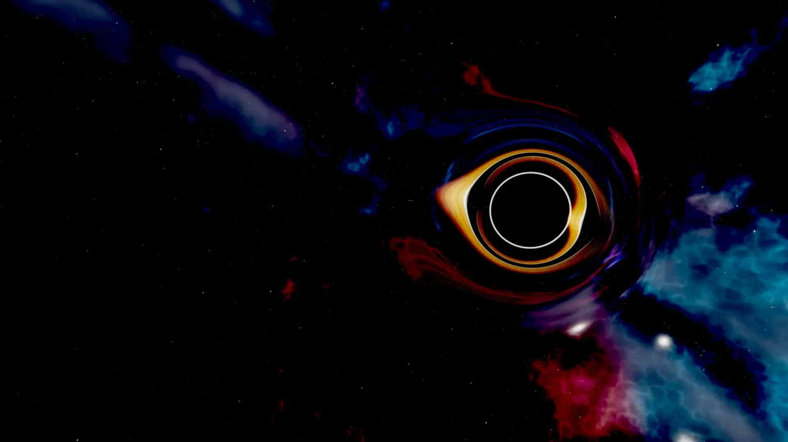
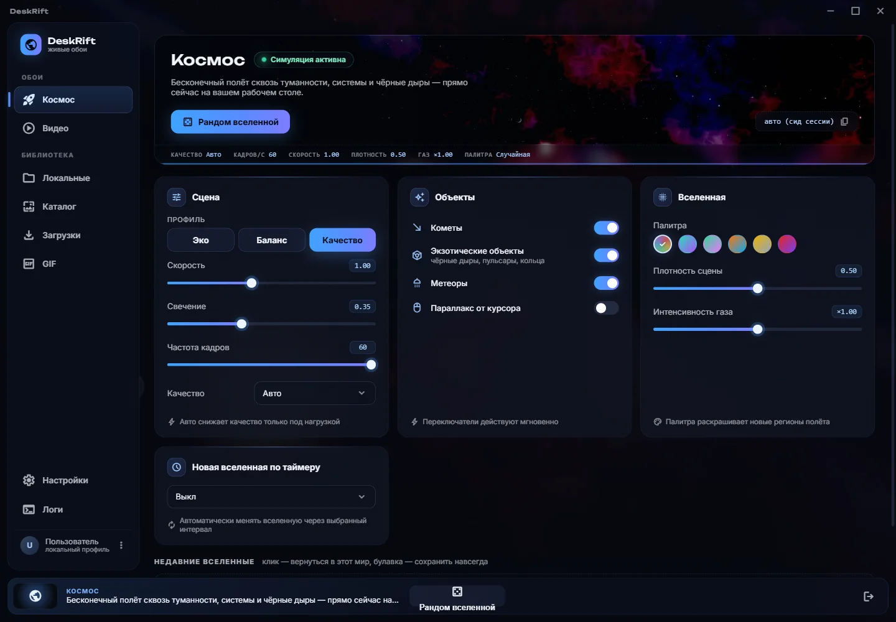
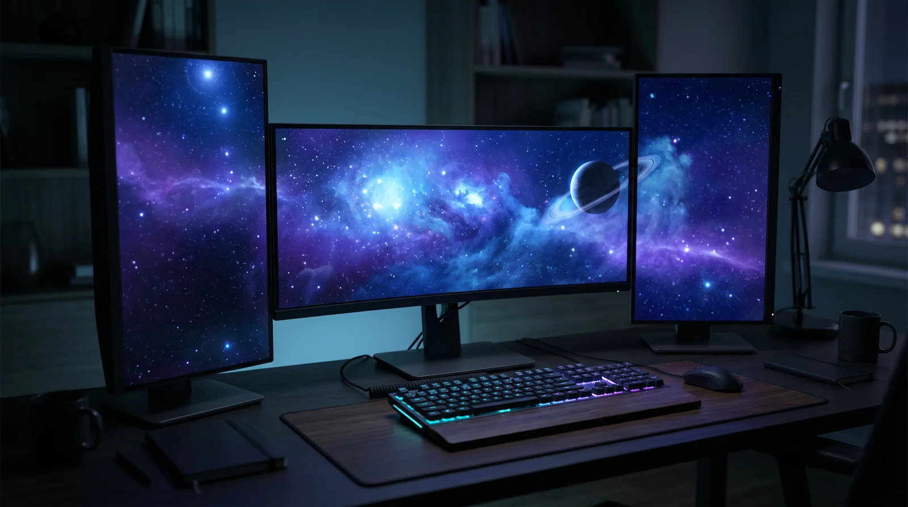
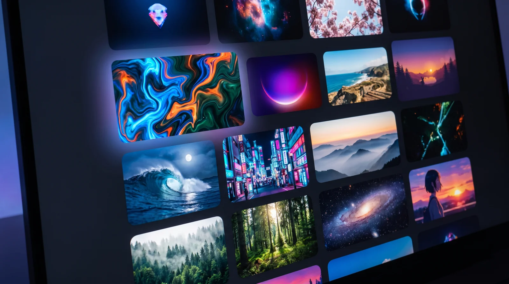

[Русский](README.md) · **English**

# DeskRift

**Living wallpapers for Windows. YouTube and RuTube videos, your own files, GIFs — and a 3D universe rendered in real time that never repeats itself.**

[🌐 Website](https://deskrift.app) · [⬇️ Download](#download) · [🐛 Report a bug](../../issues/new/choose)

<!-- Bump the version badge by hand on every release. -->

Not a stock image — a frame the engine computed on the GPU.

---

Your desktop stops being a backdrop for icons. Put on a clip, a GIF, or switch to space — and the camera flies endlessly through a procedural universe: planets with atmospheres, stars with boiling plasma, black holes with real gravitational lensing. Every launch is a different route. Start a game and the wallpaper pauses instantly, handing the GPU back in full.

## Download

| Platform | File | Size | From the site | From GitHub |
|---|---|---|---|---|
| **Windows 10/11** · installer | `DeskRift-Setup.exe` | 108.5 MB | [download](https://deskrift.app/download/DeskRift-Setup.exe) | [v0.2.8](../../releases/tag/v0.2.8) |

The site and [Releases](../../releases) host **the same file, byte for byte** — take whichever is convenient. The site link always points at the latest build; Releases keeps past versions and checksums.

On first run Windows may show SmartScreen: the installer is not code-signed yet, so the publisher is "unknown" to the system. Click **"More info" → "Run anyway"**. Only download DeskRift from the official site or from here.

**The app is free**, with no ads and no subscription. For those who want more there is **DeskRift Pro** — a one-time purchase of a perpetual license (see Pricing below).

> **Updates install only when you click.** Once a day the app asks deskrift.app whether a new version is out and shows a notification; it installs only when you press it.

## What it does

- 🪐 **A real-time 3D universe.** Not a recording — a WebGL2 simulation. Planets, nebulae, black holes, pulsars, comets, tidal disruption events. The universe is generated from a seed: a new launch is a new world.
- ▶️ **Video wallpaper by link.** Paste a YouTube or RuTube link or use the built-in search — it becomes your wallpaper right away, up to 4K.
- 📁 **Your own files and GIFs.** Local videos and seamless loops from your own disk.
- 🗂️ **Wallpaper catalogs.** Built-in collections: browse previews, apply in one click.
- 🖥️ **Multi-monitor done properly (Pro).** `span` — one continuous scene across every screen, honouring their real layout and DPI; `clone` — the same picture on each, frame-synced; `unique` — a separate universe per monitor.
- ⏸️ **0% GPU in games.** A fullscreen game or film pauses the render and frees the GPU. It comes back when you do.
- 🎚️ **Three graphics tiers.** One engine from an office laptop to a gaming rig: Light, Balanced, Maximum, plus an automatic mode.
- 🖱️ **Cursor parallax.** Space responds to mouse movement, even underneath your icons.
- 🌗 **Dark and light themes**, Russian, English and Chinese.
- 🔌 **Runs on its own.** The wallpaper lives in a separate process: set it up, close the window, the picture keeps going.

## Control center

Wallpapers, library, downloads and settings in one window.

## One setup, one scene

## Catalogs

## Requirements

- Windows 10 or 11, 64-bit
- A WebGL2-capable GPU for the space engine. Video wallpapers run on almost anything
- YouTube and RuTube need an internet connection; local files and the space engine do not

## Pricing

| | Free | **DeskRift Pro — $9.99** (790 ₽) |
|---|---|---|
| The whole universe: every graphics level, comets, exotic objects | ✓ | ✓ |
| Video by link, your own files, GIFs, wallpaper catalogs | ✓ | ✓ |
| Scene presets, Recents, auto-pause in games | ✓ | ✓ |
| Wallpaper on the main monitor | ✓ | ✓ |
| Wallpaper on every monitor | — | ✓ |
| New universe on a timer, pinned universes, your own seed | — | ✓ |
| Saving wallpapers to your library without limits | 3 times | ✓ |

Pro is a one-time payment, no subscription, a perpetual license for up to 3 personal devices, free updates. The first 14 days of Pro are free.
Buy: [deskrift.app/en/buy](https://deskrift.app/en/buy/) (USD) · [deskrift.app/buy](https://deskrift.app/buy/) (RUB).

**Seller:** sole trader Maksim Viktorovich Matsiiak, INN 772353439590 · [legal](https://deskrift.app/en/legal/) · [offer](https://deskrift.app/en/offer/) · [license agreement](https://deskrift.app/en/eula/) · [privacy](https://deskrift.app/en/privacy/) · hello@deskrift.app

## Found a bug, or want something?

[Open an issue](../../issues/new/choose) — I read all of them. It helps to include:

- your DeskRift version (user menu → "About");
- what happened and what you expected;
- a screenshot, if the defect is visible;
- a diagnostics bundle: **Settings → Logs → Export**.

## About this repository

There is **no source code here** — only the download page, releases and the issue tracker. The source is closed.

Privacy and security questions: [SECURITY.md](SECURITY.md).

---

DeskRift · <a href="https://deskrift.app">deskrift.app</a>

