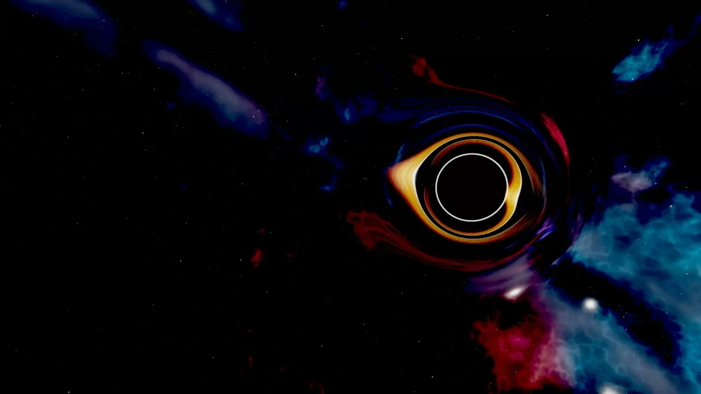
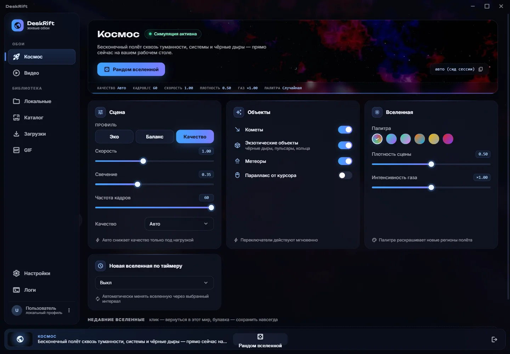
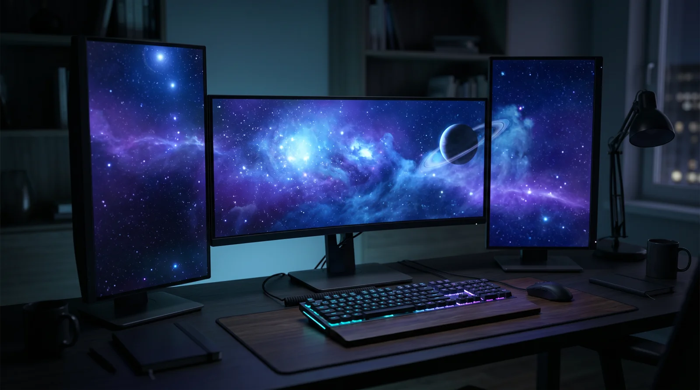
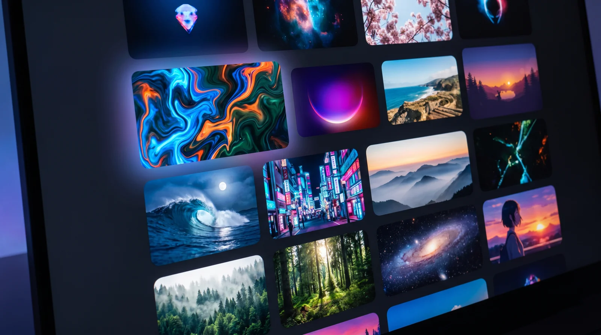

**Русский** · [English](README.en.md)

# DeskRift

**Живые обои для Windows. Видео с YouTube и RuTube, ваши файлы, GIF — и собственный 3D-космос, который считается в реальном времени и никогда не повторяется.**

[🌐 Сайт](https://deskrift.app) · [⬇️ Скачать](#скачать) · [🐛 Сообщить о баге](../../issues/new/choose)

<!-- Версию в бейдже править руками при каждом релизе. -->

Это не картинка из интернета — кадр движка, посчитанный на видеокарте.

---

Рабочий стол перестаёт быть подложкой под иконки. Поставьте ролик, GIF или включите космос — и камера бесконечно летит сквозь процедурную вселенную: планеты с атмосферами, звёзды с кипящей плазмой, чёрные дыры с настоящим гравитационным линзированием. Каждый запуск — новый маршрут. Запустили игру — обои мгновенно встают на паузу и отдают видеокарту целиком.

## Скачать

| Платформа | Файл | Размер | С сайта | С GitHub |
|---|---|---|---|---|
| **Windows 10/11** · установщик | `DeskRift-Setup.exe` | 104,8 МБ | [скачать](https://deskrift.app/download/DeskRift-Setup.exe) | [v0.2.4](../../releases/tag/v0.2.4) |

На сайте и в [Releases](../../releases) лежит **один и тот же файл, байт в байт** — берите откуда удобнее. Ссылка на сайте всегда ведёт на свежую сборку, в Releases остаются прошлые версии и контрольные суммы.

При первом запуске Windows может показать SmartScreen: установщик пока не подписан сертификатом, поэтому издатель для системы «неизвестный». Нажмите **«Подробнее» → «Выполнить в любом случае»**. Скачивайте DeskRift только с официального сайта или отсюда.

**Приложение бесплатное.** Ни подписок, ни Pro-версии, ни рекламы.

> **Обновления ставятся вручную.** В меню пользователя есть «Проверить обновления» — приложение само в фоне ничего не качает и не опрашивает. Чтобы перейти на свежую версию, нажмите эту кнопку или скачайте установщик заново.

## Что умеет

- 🪐 **3D-космос в реальном времени.** Не видеозапись — симуляция на WebGL2. Планеты, туманности, чёрные дыры, пульсары, кометы, приливное разрушение звёзд. Вселенная генерируется из сида: новый запуск — новый мир.
- ▶️ **Видео с YouTube и RuTube.** Вставьте ссылку или найдите ролик встроенным поиском — DeskRift стримит его на стол, не дожидаясь скачивания. Понравилось — сохраните в библиотеку и смотрите офлайн, до 4K.
- 📁 **Свои файлы и GIF.** Локальные видео, бесшовные петли. Свой GIF можно вырезать прямо из любого ролика, без внешних инструментов.
- 🗂️ **Каталоги готовых обоев.** Встроенные подборки: листайте превью, ставьте в один клик.
- 🖥️ **Мультимонитор по-настоящему.** `span` — одна непрерывная сцена на все экраны с учётом их реального расположения и DPI; `clone` — одинаковая картинка синхронно до кадра; `unique` — у каждого монитора своя вселенная.
- ⏸️ **0% GPU в играх.** Полноэкранная игра или фильм — рендер встаёт на паузу и освобождает видеокарту. Возвращается, когда возвращаетесь вы.
- 🎚️ **Три уровня графики.** Один движок от офисного ноутбука до игрового ПК: «Лёгкий», «Сбалансированный», «Максимум», плюс авто-режим.
- 🖱️ **Параллакс от курсора.** Космос отзывается на движение мыши даже под иконками.
- 🌗 **Тёмная и светлая темы**, русский, английский и китайский.
- 🔌 **Автономность.** Обои живут отдельным процессом: настроили, закрыли окно — картинка продолжает жить.

## Центр управления

Обои, библиотека, загрузки и настройки — в одном окне.

## Один сетап — одна сцена

## Каталоги

## Требования

- Windows 10 или 11, 64-разрядная
- Видеокарта с поддержкой WebGL2 — для космоса. Видео-обои работают практически на любом железе
- Для видео с YouTube и RuTube нужен интернет; локальные файлы и космос работают без сети

## Нашли баг или хотите что-то попросить?

[Заведите issue](../../issues/new/choose) — читаю всё. Полезно приложить:

- версию DeskRift (меню пользователя → «О программе»);
- что происходило и что ожидалось;
- скриншот, если дефект видно глазами;
- диагностический архив: **Настройки → Логи → Экспорт**.

## Об этом репозитории

Здесь **нет исходного кода** — только страница загрузок, релизы и багтрекер. Исходники закрыты.

Вопросы приватности и безопасности — в [SECURITY.md](SECURITY.md).

---

DeskRift · <a href="https://deskrift.app">deskrift.app</a>

